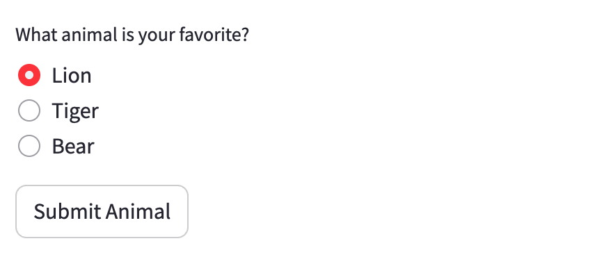
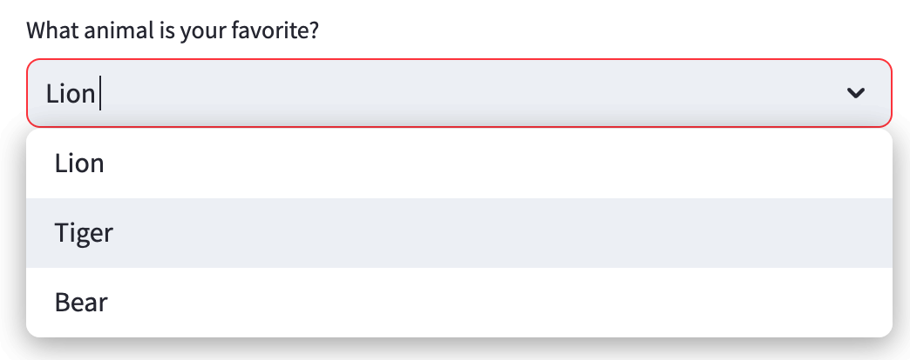
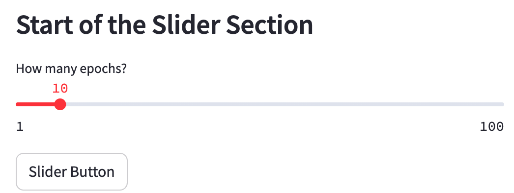
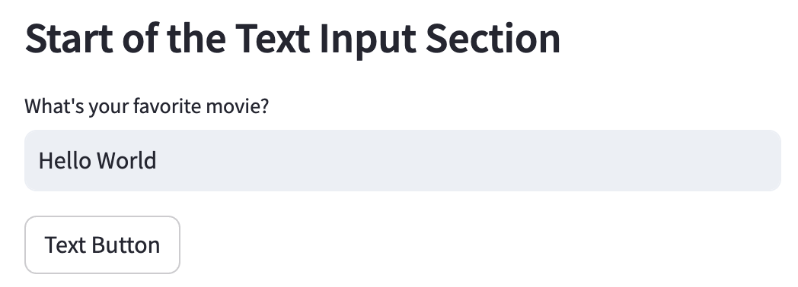
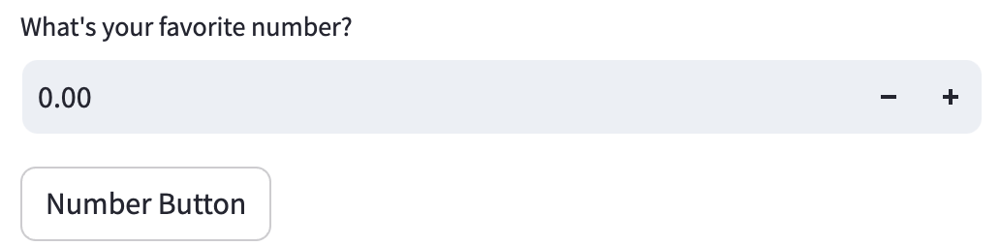
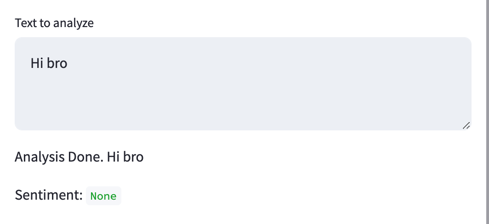

# Streamlit 教程应用 README

介绍如何使用Streamlit创建一个基本的Web应用，并将Streamlit组件与传统HTML组件进行对比。

## 应用概览

本应用演示了如何使用Streamlit的基本组件创建一个交互式Web应用。包括文本显示、按钮、复选框、单选按钮、下拉选择框、多选框、滑动条、文本输入框、数字输入框和文本区域等元素。

## 组件及其HTML对照

### 标题（`st.title`）:
  - **HTML对应组件**: `<h1>`标签


### **文本显示（`st.write`）**:
  - **HTML对应组件**: `<p>`标签


### 按钮（`st.button`）:
  - **HTML对应组件**: `<button>`标签


### 复选框（`st.checkbox`）:
  - **HTML对应组件**: `<input type="checkbox">`


### 单选按钮（`st.radio`）:
  - **HTML对应组件**: 一组`<input type="radio">`标签



### 下拉选择框（`st.selectbox`）:
  - **HTML对应组件**: `<select>`标签

### 多选框（`st.multiselect`）:
  - **HTML对应组件**: `<select multiple>`标签



### 滑动条（`st.slider`）:
  - **HTML对应组件**: `<input type="range">`



### 文本输入框（`st.text_input`）:
  - **HTML对应组件**: `<input type="text">`




### 数字输入框（`st.number_input`）:
  - **HTML对应组件**: `<input type="number">`




### 文本区域（`st.text_area`）**:
  - **HTML对应组件**: `<textarea></textarea>`



## 使用方法

1. （创建并激活一个conda环境），然后安装Streamlit库：
   ```
   pip install streamlit
   ```

2. 创建一个Python文件，比如`app.py`，并将上述代码粘贴进去。

3. 运行应用：
   ```
   streamlit run app.py
   ```

4. 访问本地服务器地址（通常是`http://localhost:8501`），查看应用。

通过Streamlit，可以轻松地将Python脚本转换为交互式Web应用。相较于传统的HTML、CSS和JavaScript开发，Streamlit提供了一种更快速、更直观的方式来构建应用，并且特别适合于数据分析和机器学习项目。